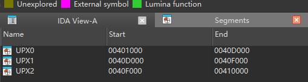
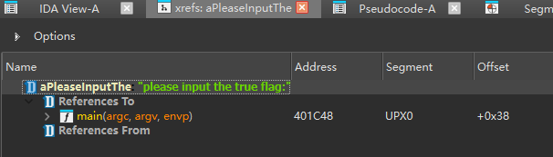

## 📋 题目信息
+ **文件名**: 新年快乐.exe
+ **类型**: Windows PE 可执行文件
+ **防护**: UPX 加壳

---

## 🔍 第一步：了解题目文件
拿到题目后，我们首先看到的是一个 Windows 可执行文件 `新年快乐.exe`。我们的目标是找到正确的 flag 输入。

当你双击运行这个程序时，它会显示：`please input the true flag:`

如果你输入正确，它会显示 `this is true flag!`；  
如果输入错误，它会显示 `wrong!`。

---

## 🔧 第二步：用 IDA Pro 打开文件
### 发现 UPX 加壳 🛡️
按 Shift + F7 打开 Segments 窗口（View → Open subviews → Segments），查看段信息，我们注意到程序被分成了三个段：



| 段名 | 地址范围 | 说明 |
| --- | --- | --- |
| UPX0 | 0x401000 - 0x40D000 | 解压后的代码段（**全部是 0xFF，被加密了！**） |
| UPX1 | 0x40D000 - 0x40F000 | 壳代码和压缩数据 |
| UPX2 | 0x40F000 - 0x410000 | 壳的运行时数据 |


**什么是 UPX 壳？**

> UPX（Ultimate Packer for eXecutables）是一个常见的可执行文件压缩工具。它会把原始程序压缩，运行时先解压再执行。就像把一个箱子压缩打包，使用时再拆开。
>

入口点是 `start` (0x40e2f0)，这是 UPX 壳的解压代码，不是程序的真实逻辑。

---

## 📦 第三步：脱壳（去除 UPX 保护）
要分析程序的真实逻辑，我们需要先把壳去掉。

### 使用 UPX 工具脱壳
首先需要下载 UPX 工具（从 [https://github.com/upx/upx/releases](https://github.com/upx/upx/releases) 下载对应系统的版本），然后在命令行执行：

```bash
upx -d 新年快乐.exe
```

输出：

```plain
Ultimate Packer for eXecutables
    File size         Ratio      Format      Name
   27807 <-     21151   76.06%    win32/pe     新年快乐.exe
Unpacked 1 file.
```

✅ 脱壳成功！

> ⚠️ **注意**：脱壳成功后，文件已经被修改。如果你再次执行 `upx -d` 会提示 `not packed by UPX`，因为文件已经不再是 UPX 壳了。这是正常的！脱壳只需要做一次。
>

---

## 🔎 第四步：定位 main 函数
脱壳后重新分析，通过**字符串搜索**找到关键线索：

| 地址 | 字符串内容 | 用途 |
| --- | --- | --- |
| 0x403024 | `please input the true flag:` | 提示用户输入 |
| 0x403043 | `this is true flag!` | 输入正确提示 |
| 0x403056 | `wrong!` | 输入错误提示 |
| 0x40305D | `HappyNewYear!` | ⭐ 关键字符串！ |


**怎么找？** 在 IDA 中按 `Shift+F12` 打开字符串窗口，就能看到程序中所有的字符串。

通过交叉引用（右键字符串 → Xrefs to，或者双击字符串，自动跳转），从 "please input the true flag:" 找到了引用它的 **main 函数**。

1. 在 **Strings 窗口** 中找到 "please input the true flag:" 那行。
2. **双击它**，跳转到字符串所在地址（应该是 0x403024）。
3. 在这个地址上**按键盘 ****X**（这是快捷键），会弹出 **Xrefs to** 窗口。
4. 双击里面的地址，就能跳到引用它的代码位置（大概率就是 main 函数里 printf 或 scanf 的位置）。



---

## 📝 第五步：反编译 main 函数
在 IDA 中找到 `0x401C10` 地址的函数，按 `F5` 反编译，得到以下 C 伪代码：

```c
int main()
{
    _WORD v1[29];  // 栈上的缓冲区

    sub_401910();  // 初始化（可以忽略）
    
    // ① 把 "HappyNewYear!" 复制到缓冲区
    strcpy((char *)v1, "HappyNewYear!");
    
    // ② 复制 word_40306B 处的 2 字节到 v1 的偏移 14 位置
    v1[7] = word_40306B;
    
    // ③ 清零 30 字节（从 v1[8] 开始）
    memset(&v1[8], 0, 0x1Eu);
    
    // ④ 打印提示
    printf("please input the true flag:");
    
    // ⑤ 读取用户输入（存到 v1[7] 位置，即缓冲区偏移 14 处）
    scanf("%s", (const char *)&v1[7]);
    
    // ⑥ 比较用户输入和 "HappyNewYear!"
    if ( strncmp(&v1[7], v1, strlen((const char *)v1)) )
        // 如果不相等（返回非0） → wrong!
        return puts("wrong!");
    else
        // 如果相等（返回0） → 正确！
        return puts("this is true flag!");
}
```

```plain
int strncmp(const char *s1, const char *s2, size_t n);
三个参数含义：

第1个参数：要比较的第一个字符串（s1）
第2个参数：要比较的第二个字符串（s2）
第3个参数：最多比较多少个字符（n）

返回值：

如果两个字符串前 n 个字符完全相同 → 返回 0
如果不同 → 返回非0值（可能是正数或负数，取决于第一个不同字符的 ASCII 值）
```

---

## 📚 涉及的逆向知识总结
| 知识点 | 说明 |
| --- | --- |
| **UPX 加壳** | 程序被压缩保护，需要先脱壳才能看到真实代码 |
| **IDA Pro** | 业界标准的反汇编/反编译工具 |
| **字符串窗口 (Shift+F12)** | 查看程序中所有字符串，逆向第一步 |
| **交叉引用 (Xref)** | 通过字符串找到引用它的函数，定位关键代码 |
| **反编译 (F5)** | 将汇编代码还原成接近 C 语言的伪代码 |
| **strncmp** | C语言的字符串比较函数，`strncmp(a, b, n)` 比较前 n 个字符 |
| **scanf** | C语言的输入函数，`scanf("%s", buf)` 读取字符串 |
| **puts/printf** | C语言的输出函数 |
| **脱壳** | 去除 UPX 等壳保护，还原程序原始代码 |


---

